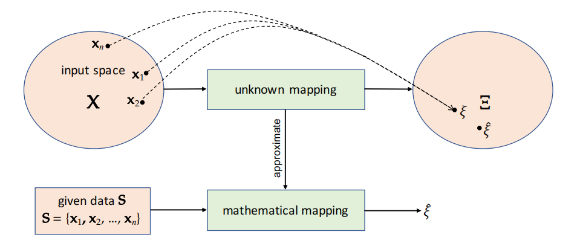

# 第一章 概述
本章我们会介绍各种机器学习任务，包括**监督学习**、**无监督学习**、**半监督学习**和**强化学习**。然后我们用一个示例来介绍一些关键概念，其中包括**特征选择**，**特征提取**，**分割**，**训练**和**评估**预测模型。最后还讨论了Python语言在当今机器学习中扮演的重要角色。
## 监督学习
监督学习的基本假设是输入和输出空间包含某些随机变量的所有可能实现，并且这些空间存在某种未知的关联。他的目标是利用给定的数据来学习数学映射，从而能够为输入空间中的任意元素估算出输出空间中的对应值。在机器学习中，我们通常将这种估计输出空间元素值的行为称作**预测**。为此，在监督学习中，给定数据中一般包括输入空间的一些元素（实例）以及输出空间与之对应的元素值。监督学习主要有2种类型：**分类**和**回归**。

&emsp;
如果输出空间包含分类随机变量的实现，则该任务称为***分类***，模型称为***分类器***。如果输出空间包含数值随机变量（连续或离散）的实现，则该任务称为***回归***，模型称为***回归器***。分类的一个例子就是将图像识别为猫或狗（图像分类）。为了学习从输入空间（图像）到输出空间（猫或狗）的映射，需要使用许多带有相应标签的图像。而回归的一个例子就是估计某个图像中物体的包围矩形（边界框）的水平和垂直坐标。为了学习从输入空间（图像）到输出空间（边界框的坐标）的映射（回归量），需要使用大量带有4个目标值（2个为物体的忠心点坐标，2个为物体的宽带和高度）的图像。

*监督学习：给定数据是一个集合 S，包括输入空间的元素（即 x1、x2、......、xn）和输出空间的相应元素（即 y1、y2、......、yn）。我们的目标是利用 S 学习一种数学映射，这种映射可以估计（预测）输入空间中任何给定元素在输出空间中的对应元素*
## 无监督学习
在无监督学习中，数据仅包含输入空间的样本（一些随机变量的实现）。他的目标是利用给定的数据学习数学映射，从而估算出数据在输出空间中相对应的元素。然而，输出空间的定义取决于具体的任务。举个例子，在***聚类***这一重要的无监督学习任务中，目标是在给定数据中发现一系列具有相似观测结果的组。因此，输出空间包括给定样本的所有可能分区。在这里，我们可以把分区看作是一种函数，它为观测值分配一个唯一的组标签，从而使给定样本中的每个观测值都只会分配到一个标签上。例如，图像分割可以表示为一个聚类问题，其目标是将图像划分为若干片段，每个片段包括属于某个对象的像素。其他类型的无监督学习包括***密度估计***和某些***降维***技术，其输出空间分别包括可能的概率密度函数和数据在低维空间的可能投影。

*无监督学习：给定数据是一个集合 S，包括输入空间的元素（即 x1、x2、...、xn）。我们的目标是利用 S 学习一个数学映射，将 S 投射到输出空间的元素上*