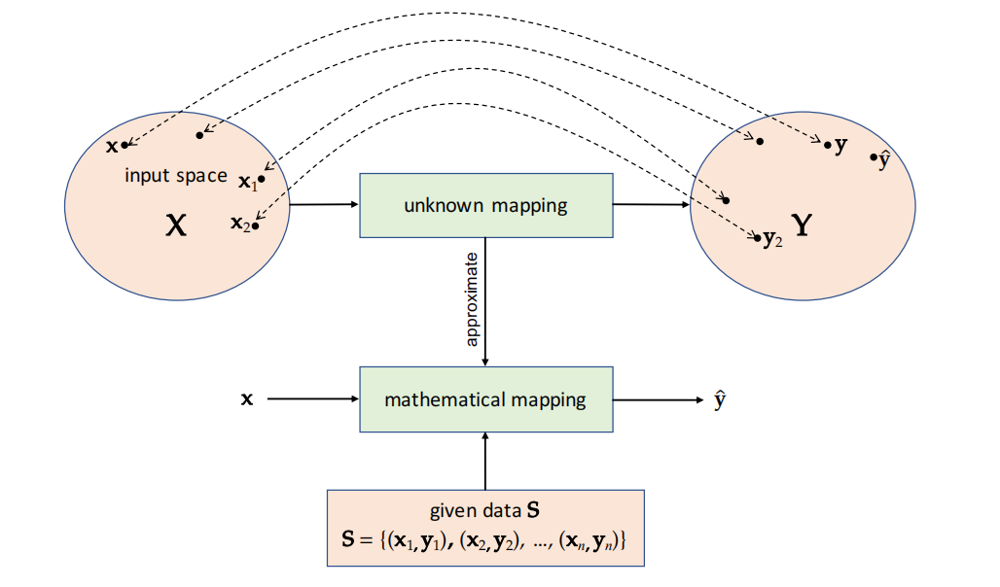

# 第一章 概述
本章我们会介绍各种机器学习任务，包括**监督学习**、**无监督学习**、**半监督学习**和**强化学习**。然后我们用一个示例来介绍一些关键概念，其中包括**特征选择**，**特征提取**，**分割**，**训练**和**评估**预测模型。最后还讨论了Python语言在当今机器学习中扮演的重要角色。
## 监督学习
监督学习的基本假设是输入和输出空间包含某些随机变量的所有可能实现，并且这些空间存在某种未知的关联。他的目标是利用给定的数据来学习数学映射，从而能够为输入空间中的任意元素估算出输出空间中的对应值。在机器学习中，我们通常将这种估计输出空间元素值的行为称作**预测**。为此，在监督学习中，给定数据中一般包括输入空间的一些元素（实例）以及输出空间与之对应的元素值。监督学习主要有2种类型：**分类**和**回归**。

&emsp;&emsp;
如果输出空间包含分类随机变量的实现，则该任务称为***分类***，模型称为***分类器***。如果输出空间包含数值随机变量（连续或离散）的实现，则该任务称为***回归***，模型称为***回归器***。分类的一个例子就是将图像识别为猫或狗（图像分类）。为了学习从输入空间（图像）到输出空间（猫或狗）的映射，需要使用许多带有相应标签的图像。而回归的一个例子就是估计某个图像中物体的包围矩形（边界框）的水平和垂直坐标。为了学习从输入空间（图像）到输出空间（边界框的坐标）的映射（回归量），需要使用大量带有4个目标值（2个为物体的忠心点坐标，2个为物体的宽带和高度）的图像。

*监督学习：给定数据是一个集合 S，包括输入空间的元素（即 x1、x2、......、xn）和输出空间的相应元素（即 y1、y2、......、yn）。我们的目标是利用 S 学习一种数学映射，这种映射可以估计（预测）输入空间中任何给定元素在输出空间中的对应元素*
## 无监督学习
在无监督学习中，数据仅包含输入空间的样本（一些随机变量的实现）。他的目标是利用给定的数据学习数学映射，从而估算出数据在输出空间中相对应的元素。然而，输出空间的定义取决于具体的任务。举个例子，在***聚类***这一重要的无监督学习任务中，目标是在给定数据中发现一系列具有相似观测结果的组。因此，输出空间包括给定样本的所有可能分区。在这里，我们可以把分区看作是一种函数，它为观测值分配一个唯一的组标签，从而使给定样本中的每个观测值都只会分配到一个标签上。例如，图像分割可以表示为一个聚类问题，其目标是将图像划分为若干片段，每个片段包括属于某个对象的像素。其他类型的无监督学习包括***密度估计***和某些***降维***技术，其输出空间分别包括可能的概率密度函数和数据在低维空间的可能投影。

*无监督学习：给定数据是一个集合 S，包括输入空间的元素（即 x1、x2、...、xn）。我们的目标是利用 S 学习一个数学映射，将 S 投射到输出空间的元素上*
## 半监督学习
半监督学习介于监督学习和无监督学习之间，一般假设他有2种类型的数据：

1. 一种是类似于监督学习的数据，他们包括输入输出对的实例。通常被称为***标记数据***。
2. 另一种是类似于无监督学习的数据，他们只包括输入空间的实例。通常被称为***非标记数据***。

通常，当标记数据量少于非标记数据量时，半监督学习就会非常有用。由于半监督学习的数据介于监督学习和无监督学习之间，因此其应用也介于监督学习和无监督学习之间。例如，我们可能想根据一些标记数据改进常规的聚类算法。半监督学习的一个重要内容是自我训练，这对于标记过程费时费力、成本高昂的情况尤为重要。在这些应用中，分类器是在有限的训练数据上进行训练的，我们使用这些数据对大量非标记数据进行标记，这些标记被称为***伪标记***。然后，未标记的数据及其伪标签将被用于更新初始训练模型。
## 强化学习
强化学习试图将自然学习的过程程序化，即通过与世界环境的互动，从过去的经验中做出正确的决策。在这种情况下，通常把决策者称为***代理***，把与代理互动的任何事物称为***环境***。在时间步骤 *t*，代理接收到一个称为***状态***的环境表示，表示为 **s**t∈ S，其中 S 是所有可能状态的集合。根据 **s**t，代理在 **a**t∈ A(**s**t)处采取***行动***，其中 A(**s**t) 表示在 **s**t 状态下所有可能行动的集合。作为采取行动**a**t的结果，环境会在 t+1 时给代理一个数字奖励，并让代理进入新的状态 **s**t+1。我们的目标是估算出一个映射（策略）π，它是一个根据状态来采取可能行动的概率的函数，从而使未来的预期总回报最大化。为了解决这个估计问题，一般假定环境的动态具有马尔可夫性质。也就是说，当给定 t 时的状态和行动后，环境在 t + 1 时做出反应的概率与过去所有可能的行动、状态和奖励无关。有了这一特性，环境就定义了一个***马尔可夫决策过程***，并且存在多种技术来确定最佳策略。
## 设计流程
无论具体任务如何，为了学习映射函数，从业者通常遵循3个阶段过程，我们称之为***设计流程***：
- **第一阶段**：选择一套“学习”规则（算法），在给定数据的情况下生成映射；
- **第二阶段**：根据手头的数据估算映射；
- **第三阶段**：修剪候选的映射集，找到最终映射。

&emsp;&emsp;
一般来说，不同的学习规则会产生不同的映射，而每种映射实际上都是真实世界现象的数学模型。根据现有数据估算特定映射的过程（第二阶段）被称为***学习***（最终映射）或***训练***（规则）。因此，在这个估计问题中使用的数据被称为***训练数据***，根据应用的不同，训练数据也可能不同。例如，在监督学习中，数据基本上是从输入-输出空间中采样的实例。训练阶段一般有别于***模型选择***阶段，后者包括初始候选集选择（第一阶段）和最终映射选择（第三阶段）。尽管如此，有时也会把这三个阶段过程统称为训练。

&emsp;&emsp;
让我们再详细介绍一下这些阶段。以ANN为例，输入空间和输出空间之间存在各种预定义的数学规则。这些数学规则也用于对不同类型的ANN进行分类；例如，多层感知机、递归神经网络、卷积神经网络和transformers等等。在第一阶段，从业者通常需要利用自己对数据的先验知识来选择一些学习规则，以保证在给定的应用中能正常发挥作用。不过有时第一阶段的候选集选择并不仅仅是在各种规则之间做出选择。以ANN为例，即使是特定的神经网络（多层感知机）也可以变得非常通用，这取决于其结构中可使用的某些特定的非线性函数、参数数量以及它们在网络层次结构中的运行方式。这些参数本身就能极大的影响映射的质量。因此，这些参数被称为***超参数***，以区别于映射本身的参数。

&emsp;&emsp;
因此，在第一阶段，从业者还需要决定超参数空间可以探索到什么程度，这也许是学习过程中最“艺术”的部分；也就是说，我们需要根据先前的经验、可用的搜索策略和可用的计算资源，来缩小通常是无限维度的超参数空间。在第一阶段结束时，我们做的工作本质上就是为现实世界的问题选择一组候选的数学近似和学习规则，这些规则在给定的数据下会产生特定的映射。
## 人工智能
说回LaMDA,当Lemoine把他对LaMDA的“采访”发布到网上时，由于他猜测LaMDA是有感知能力的，这很快就引起了病毒式传播以及媒体的关注，而这也导致谷歌让他休了行政假。和许多其他机器学习模型类似，神经网络（例如LaMDA）本质上还是上述三个阶段设计过程的结果。由于它是为对话应用而训练和使用的，因此和许多其他神经语言模型类似，输入和输出空间都是单词序列。具体来说，给定输入单词序列后，语言模型一般会生成单个单词或单词序列作为输出。然后生成的输出本身又可以作为输入的一部分，以生成更多的输出单词。尽管用于模型选择和训练的并行计算硬件放大了许多令人印象深刻的算法进步，从而产生了LaMDA,但他只是单词输入空间到输出空间的映射；而这种映射的参数是以0和1的形式存储在谷歌服务器上的一些硅存储单元中。为了防止将科学和神话谬论混为一谈，不妨更认真的考虑一下LaMDA创作者的以下几句话：
> 最后，必须承认的是，LaMDA的学习是基于模仿人类在对话中的表现，这于许多其他对话系统类似。与人工系统进行高质量、引人入胜的对话，并最终在某些方面与人类对话无异，这条路现在很有可能跑通。人类可以在不知道系统是人造的情况下与之互动，或者通过赋予系统某种形式的个性来将其拟人化。

&emsp;&emsp;
现在的问题是，我们是否可以把LaMDA生成文本的能力，或者说任何其他表现出色的机器学习模型的能力，是为是一种***智能***？尽管对这个问题的回答应该从智能的定义开始，而智能的定义可能会因此其他几个术语的定义，但就智能术语的正常使用而言，这个问题的答案通常是肯定的，而且我们将自然智能（比如人类的智能）和***人工智能***（比如LaMDA的智能）区分开来。从这个意义上来说，机器学习是一门大有可为的学科，可以用来创造人工智能。
