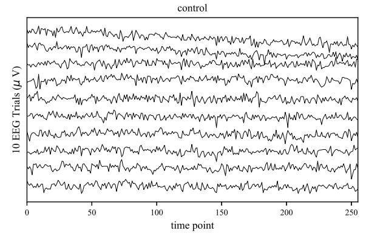
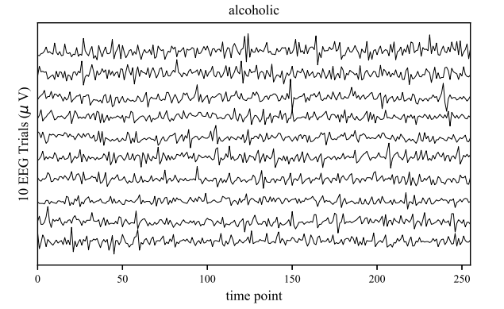
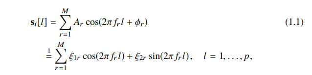

# 举例说明
为了进一步阐明和演示上述三个阶段的设计过程中所涉及的一些步骤，我们在此举一个例子。这个例子以脑电图分类任务为原型，尝试介绍一些通用的机器学习概念，包括特征选择、特征提取、分割、训练和评估预测模型。
## 数据
我们采集了一系列脑电图（EEG）记录，这些记录作为脑电图数据库存储在UCI KDD Archive中并公开提供。该数据集有多种形式，包含对照组（非酒精中毒者）和病例组（酒精中毒者）受试者在各种刺激组合（某些物体的图片）下的脑电图记录。我们使用的是单刺激案例，即受试者接触刺激300毫秒，并在反应出现后150到400毫秒之间记录脑电图。为了进行训练，我们采用“小型数据集”，其包含放置在两个受试者头皮上的64个电极帽的脑电图记录，这两个受试者分别被识别为co2a0000364（酒精中毒者）和co2c0000337（对照组），每秒进行10此试验，采样率为256Hz。我们的目标是训练一个分类器，使其能够根据一个人的脑电图记录来将其区分为酗酒者和非酗酒者。
## 特征选择
在此，我们根据对此问题的先验知识，指考虑从其中一个传感器（C1信道）进行的测量，并认为它包含了大量类别间的判别信息。下图显示了上述两个受试者在C1信道上的10次脑电图记录。令成对的集合 **S** = {(**x**1, y1), ..., (**x**n, yn)} 表示我们使用的两个受试者的所有可用脑电图记录，其中 yi 是类别变量的实现，取值为 0（表示对照组）或 1（表示酒精中毒）。因为我们有两个受试者且每个人有10次试验，所以 n = 2 × 10 = 20。同时，由于每个**x**i包含一秒钟内收集的256个数据点（回想一下，采样率为256Hz，每次试验持续时间为1秒），因此可以将其视为一个列向量 **x**i ∈ **R**p ，p = 256，一般称为***特征向量***。顾名思义，特征向量的每个元素都是一个***特征***（也称为***属性***），因为它测量的是所研究对象（这里指大脑反应）的一个属性。例如，**x**i的第lth维度的特征值是一个随机变量的实现，它测量的是C1信道在偏移量为l-1的时间点的值，其中l=1,...,256，从特征向量记录的第一个时间点开始。我们将 n 和 p 分别称为***样本大小***和***特征向量的维度***。我们的目标是使用**S**(包含 n 个输入-输出空间元素)来训练分类器。

*训练数据：受试者所有10次试验的C1信道的脑电图记录。上图为对照组，下图为病例组*

如果我们选取的是 m 个通道而不仅仅是C1通道，那么每个 **x**i 都将是一个 256 × m 的特征向量。不过，正如我们将在第10章中看到的，识别“重要”特征或去除“冗余”特征通常是有用的--这一过程被称为特征选择。同时，特征选择可以基于数据本身，也可以基于先验知识。因此，我们对C1信道的选择可以看作是基于先验知识的特征选择，因为我们已经将特征向量的潜在维度从 256 × m 减少到 256。
## 特征提取
在设计流程的第一阶段，我们会面临各种各样的学习算法和模型，因此，我们需要依靠脑电图相关的一些先验知识来缩小我们的模型选择范围。例如，有的人会直接使用脑电数据集S来训练各种形式的神经网络，而有的则会根据先验知识，首先从这些收集到的 **x**i 中***提取***一些感兴趣的特征，然后再使用其他形式的分类器。在这里我们为了说明问题，采用后一种方法。为此，我们需要使用一些在统计信号处理中的一些***信号建模***技术。信号建模的目的是用一个估计向量 **s**i ∈ **R**p 来表示 **x**i ∈ **R**p ，该向量存在于q维子空间中（q < p）。换句话说，尽管对于 **x**i 的每个元素（表示为 **x**i[l]，l=1，...，p），我们都有一个估计 **s**i[l]（**s**i 的对应元素），以便完整表示 **s**i[l]，l=1，...，p，但我们只需要q个特征。这种估计问题可以看作是一个特殊的降维问题，称为***特征提取***，也就是提取数据（信息）的特征。一般来说，特征提取中使用的变换将一些输入特征转换为输出特征，这些输出特征可能与输入特征存在一定的物理解释，也可能不存在。例如特征选择可以被视为一种特殊的特征提取，其在选择过程中保留了特征的物理性质，但在本节中，我们将使用一种特征提取，来将原始特征（随时间变化的信号幅度集）转换为某些正弦曲线的频率和振幅。

&emsp;&emsp;
作为本应用的信号模型，我们选择了频率、相位和振幅未知的正弦曲线之和，该模型曾在类似应用中使用过。即：

其中 M 是由我们自己确定或根据数据来估计（调整）的模型阶数（超参数），1 = 是由于 cos(α + β) = cos(α) cos(β) - sin(α)sin(β) ，ξ1r = Ar cos(φr ) ，ξ2r = -Ar sin(φr ) ，且 0 < fr < fr+1 < 0.5，r = 1，...，M。 请注意，si[l] 对所有 l = 1, ..., p 都有定义，但根据 (1.1)，为了完全表示 si[l]，我们只需要 3M 个特征，其中包括 2M 个振幅和 M 个频率（该表示法中的其余部分是一些确定性函数）；下文中，我们将由这 3M 个特征构建的向量称为 θi 。换句话说，我们可以用一个包含 3M 特征值的向量 θi 来估计和表示每个 xi。为了完全严谨起见，模型（1.1）中使用的所有参数最好都加上索引 i，因为每个观测值 xi 的参数都可能不同；不过，为了便于记述，我们在 Ai,r 、φi,r 、fi,r 、ξ1,i,r 和ξ2,i,r 中省略了这些索引，写成（1.1）。